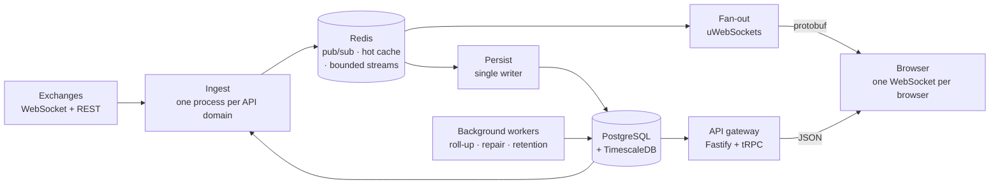

# Architecture

Orientation for a reader of this excerpt: what the whole system is, and where the
published code sits inside it. Nothing here is required to read the code — it is
here so that the code does not have to be read blind.

The full internal architecture map is not published. This is the part that
explains the excerpt.

---

## 1. What the product does

Vibe Screener is a real-time analytics service for crypto derivatives. It watches
every instrument on several exchanges at once, keeps a continuous history of
them, and puts that in front of a trader as charts, a filterable instrument list,
and cross-venue signals.

The load-bearing facts about the problem, which shape everything below:

- **Thousands of instruments, not one.** Roughly 2 900 instruments across three
  exchanges. Any design that is per-instrument-expensive does not survive.
- **A venue's spot and futures planes are separate systems.** Different
  endpoints, different symbol spellings, different limits, different failure
  modes. Treating them as one venue is a category error that shows up later as
  data loss.
- **The upstream is unreliable by nature.** Sockets drop, venues rate-limit,
  history endpoints paginate differently from each other, and some of them
  answer a ban with a status code that looks like an ordinary refusal.
- **A candle, once wrong, stays wrong.** Live data is disposable; the journal is
  not. Most of the care in this codebase is about that asymmetry.

---

## 2. The shape of the system

Three properties are worth naming, because they are the reason the system holds
together rather than incidental implementation choices.

**Two independent paths out of Redis.** The live path — "radio" — carries the
current bar to browsers and is allowed to drop frames under pressure. The
journal path is a bounded Redis stream consumed by exactly one writer, and it is
allowed to be slower but never lossy. Neither path can take the other down.

**Ingest and fan-out never share a process.** They meet only in Redis. A venue
misbehaving cannot stall the delivery loop that a user is watching, and the
delivery edge holds no state that matters across a reconnect: a client heals by
asking for a fresh snapshot.

**One process per API domain.** Twelve long-running processes in production: an
HTTP gateway, the WebSocket fan-out, the single journal writer, a background
worker host, a cross-venue comparison worker, a synthetic canary, and six ingest
processes — one for each (exchange, market) pair. They are single-instance by
construction; a second copy of an ingest process would duplicate the venue
subscriptions it owns.

---

## 3. Storage

Candles and metrics live in TimescaleDB hypertables, in three anchor resolutions
each — one minute, one hour, one day. Coarser series are not aggregates over the
finer one: the minute series is a rolling window, and an aggregate cannot outlive
its source, so the hourly and daily series are written directly by a roll-up
worker from data that is already durable.

Everything else — accounts, the instrument registry, chart state — is ordinary
relational data, twenty-three tables.

Redis holds working state, never the record of truth: the live pub/sub channels,
a hot cache that serves the snapshot a client gets on connect, the bounded
journal streams, and one watermark per instrument recording how far its history
has been persisted. That watermark is what makes repair possible: it is the
question "where did we stop" answered without scanning anything.

---

## 4. Access control

Which data a subscriber may receive is decided **server-side**, from one ordered
policy list stored as configuration rather than code. It is consulted at five
points — the WebSocket subscribe, the re-evaluation of live subscriptions when a
plan changes, both history endpoints, and one pull query.

Two properties matter more than the mechanism. It is **default-deny**: a topic
with no matching rule is refused, with the same generic code as an unknown
feature, so a refusal never reveals that a paid capability exists. And it is
**fail-closed**: before the policy has loaded, and if the stored policy fails
validation, the previous known-good rules keep serving — a malformed
configuration cannot silently open access.

The consequence worth stating plainly: data a subscriber may not have is never
transmitted to them. It is not hidden in the interface; it does not arrive.

The implementation of this is not part of the excerpt.

---

## 5. Where this excerpt sits

The published code is the shaded middle of the diagram — how we talk to an
exchange and how candles become trustworthy history. It contains:

| Directory | Role in the system |
|---|---|
| `src/adapters/` | the venue boundary, and one complete venue behind it |
| `src/rest/` | how outbound REST requests stay inside a venue's rate limit |
| `src/core/derive.ts` | how coarser timeframes are computed from the anchor |
| `src/workers/gap-fill.ts` | how a gap in history is detected and repaired |
| `src/db/history-reader.ts` | how stored history is read back, page by page |
| `src/core/*` | the shared vocabulary those pieces are written in |

It does **not** contain the WebSocket fan-out, the HTTP gateway, the tier policy
engine, authentication, the client application, the database schema, or the other
two exchange adapters. Some of that is out of scope for a code sample; the
authentication and abuse-defence layer is excluded deliberately, because the
service is live and those are the one category of code whose publication would
help an attacker rather than a reviewer.

---

## 6. Reading order

If you have five minutes, read in this order:

1. **`src/adapters/types.ts`** — the entire contract between the platform and an
   exchange. Everything venue-specific is on one side of this file.
2. **`src/rest/budget-split.ts`** — the header explains an invariant that was
   false in a way no single process could detect. This is the most interesting
   bug in the excerpt.
3. **`src/workers/gap-fill.test.ts`** — what "the socket dropped" actually costs,
   and the two pagination traps that make a naive repair silently incomplete.

If you have twenty, add `src/rest/dispatcher.ts` and
`src/adapters/bybit/ticker-engine.ts`.
