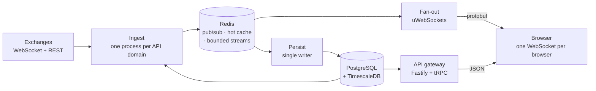

# VIBE Screener — source excerpt

**This is a fragment of a production system, not the whole codebase.** VIBE
Screener is a real-time crypto-derivatives analytics service running at
[vibescreener.app](https://vibescreener.app), built and operated by a small
team. What follows is a curated slice of its data plane — about 3 500 lines of
implementation and 1 550 lines of tests — published so that the code can be read
and evaluated as part of an application to the President Tech Award 2026. See
[LICENSE](LICENSE).

Everything here compiles and its tests pass on their own:

```
npm install
npm run typecheck   # tsc --noEmit, strict
npm test            # 77 tests, 9 files
```

No database, no Redis and no network access are required to run them.

---

## What the whole system does

Market data from three exchanges — six API domains, since a venue's spot and
perpetual-futures planes are separate systems — is collected, normalised behind
one adapter interface, and split into two independent paths: a live path that
reaches the browser over WebSocket, and a journal that lands in TimescaleDB.



The excerpt covers the shaded middle of that picture: how we talk to an
exchange, how we stay inside its rate limits, how candles are derived and
repaired, and how history is read back.

---

## Why this slice

The selection is not "the easy parts" or "the parts with no secrets in them".
Each subsystem was chosen because it answers a question a reviewer would
reasonably ask about a system like this.

### 1. The venue seam — `src/adapters/`

*"You say three exchanges. What happens when you add a fourth?"*

[`adapters/types.ts`](src/adapters/types.ts) is the entire contract between the
platform and a venue: eleven members, with capabilities advertised **as data**
rather than discovered by asking "is this venue X". The rule the file enforces is
that no exchange-specific code exists anywhere else. Adding a venue is an adapter
plus a registry row.

[`adapters/bybit/`](src/adapters/bybit) is one complete implementation of that
contract — dialect, connection, pool, instrument catalogue and a ticker delta
engine, with its tests. It is a genuinely awkward venue to integrate: the
per-symbol ticker stream sends partial deltas, funding and open interest ride
that same stream rather than a dedicated one, and a minute boundary can pack a
closed bar and its successor into a single frame on one market but two frames on
another. Those are exactly the details that make a "just parse the JSON" adapter
wrong in production, so they are worth reading.

### 2. Staying inside a venue's rate limit — `src/rest/`

*"How do you avoid getting banned?"*

This is the piece we would point at first. The interesting part is not the token
bucket in [`dispatcher.ts`](src/rest/dispatcher.ts); it is the observation in
[`budget-split.ts`](src/rest/budget-split.ts) that the obvious invariant was
false in a way no local check could see. A venue counts requests per host and IP.
We run several processes against one venue. Each process independently obeyed
"never exceed the venue budget", each was individually correct, and the fleet was
still at 1.8× the limit. The fix is a declared static split asserted at every
boot, so configuration drift crashes a process rather than earning a ban later.

The comments also record the alternative we rejected — a shared dynamic window
over Redis — and why: it requires an `await` inside the drain loop, a partial
Redis failure produces the exact overshoot it exists to prevent, and it destroys
the only cross-process priority isolation the system has. What *is* shared is
only the pause, because a 429 is the venue's own verdict rather than our model of
it ([`pause-share.ts`](src/rest/pause-share.ts)).

### 3. Timeframe derivation — `src/core/derive.ts`

*"Do your five-minute candles agree with your database?"*

One algorithm over an anchor mapping, with zero per-timeframe branches, folding
bars in an order-independent way that is deliberately identical to what the
database would compute. The test asserts that equivalence directly, because it is
the property that lets a chart mix live derived bars with stored history and see
a single continuous series.

### 4. Self-healing history — `src/workers/gap-fill.ts`

*"A socket dropped for ninety seconds. Now what?"*

Every reconnect is assumed to have cost us bars until proven otherwise, so the
heal runs generously and is a no-op by construction when there was nothing to
fix. The subtle parts are in the tests: a gap wider than one page must fill
completely regardless of which end of the range the venue paginates from, and a
venue whose deep-history endpoint has a *smaller* page cap than its recent one
will otherwise strand bars in a hole that nothing ever revisits.

### 5. Reading history back — `src/db/history-reader.ts`

*"How does infinite scroll-back not duplicate or skip a bar?"*

Closed bars only, never the in-progress bucket; an exclusive upper-bound cursor
for paging strictly older data. It lives on the shared side because two packages
that may not import each other both need it, and an import-boundary linter
enforces that.

---

## What was changed for publication

Nothing was rewritten to look better. Four changes were made so the excerpt could
stand alone, and they are listed here rather than left for a reader to discover:

1. **Comments were translated and de-referenced.** The originals cite internal
   documents, dated design rulings and tracker items. The reasoning is intact —
   including the reasoning behind decisions we later reversed — but the pointers
   into private documents are gone.
2. **The environment module is narrowed.** The real service validates one large
   configuration schema at boot and fails closed. That schema also carries the
   settings of the abuse-defence layer, which is deliberately out of scope here,
   so [`core/env.ts`](src/core/env.ts) declares only the venue endpoint overrides
   this code actually reads.
3. **One test lost coverage, not correctness.** The budget-split boot assertion
   normally runs over every venue the fleet deploys. With one venue published, it
   runs over that venue's two domains. The mechanism is identical; the coverage
   is narrower, and the test says so.
4. **A shared proxy-agent helper was moved.** In the full repository it happens to
   live inside the first venue's directory and is imported by the others — an
   untidy seam we have recorded. Here it sits in `core/` where it belongs.

## What is deliberately absent

Authentication, sessions, rate limiting, the circuit breaker, the abuse-defence
layer and their configuration are **not** published, and not because they are
unfinished. The service is live with real users; the tuning values of those
systems are the one category of code where publication would hand an attacker a
free advantage. The data plane has no such property, so it is published in full.

Also absent, simply because they are outside the story this excerpt tells: the
WebSocket fan-out edge, the tier-policy engine, the HTTP gateway, the client, the
database schema and migrations, and the other two exchange adapters.
